# Galería — máscaras y pantones sobre 100 imágenes inéditas

Las etapas de *SegmentR* que sobrevivieron a la réplica — color CIELAB, artefacto JSON, QA y recortes — alimentadas por el segmentador U-Net de Argiope en lugar de GroundedSAM.

- **81 de 100** imágenes producen máscara de opistosoma; **19** no devuelven ningún píxel.
- Muestreo estratificado por especie sobre `data/raw/gbif`, **sin solape** con las 150 imágenes anotadas para entrenar (verificado con aserciones).
- Sin ground truth: aquí no hay IoU. La medida con anotaciones es otra — IoU 0,765 mediano sobre el held-out, y color indistinguible del de la máscara a mano (ΔE 1,51) donde IoU ≥ 0,7.

- Modelo: checkpoint actual `resnet50`, 512 px, 130 MB, de 2026-09-03 20:40. Una versión previa de esta galería usó el checkpoint anterior (`resnet34`, 98 MB) y daba 73 de 100.

> **Con máscara no quiere decir correcta.** Inspeccioné 12 de las 81 a ojo y los abdómenes son en general plausibles. El falso positivo del pase anterior (`0e680af89364aa64.jpg`, que segmentaba una hoja) con este modelo no devuelve máscara. A cambio, **3 de las 81 máscaras ocupan menos del 0,1 % del encuadre** (210, 1.325 y 2.137 px): son fragmentos, no opistosomas. Las tres puntúan por debajo de 0,70 frente a una mediana de 0,959, así que un filtro por score las separa. La auditoría es parcial y no se extrapola.

La versión interactiva, con la distribución de áreas y la tabla por especie, está en [`galeria.html`](galeria.html) (GitHub no renderiza HTML en el navegador del repo: descárgalo, o sírvelo con GitHub Pages).

## Procedencia de las fotografías

Cada fotografía es de terceros, obtenida vía GBIF, y se reproduce aquí **con atribución** bajo su licencia Creative Commons. Créditos por imagen en la última columna de cada fila.

| Licencia | Imágenes |
|---|---:|
| [CC-BY-NC](https://creativecommons.org/licenses/by-nc/4.0/) | 72 |
| [CC-BY](https://creativecommons.org/licenses/by/4.0/) | 7 |
| [CC0](https://creativecommons.org/publicdomain/zero/1.0/) | 2 |

`CC-BY-NC` no permite uso comercial. Las máscaras y paletas derivadas son resultado de este análisis; las fotografías siguen siendo de sus autores.

## Las 81 con máscara

Foto con el contorno de la máscara en amarillo y el fondo atenuado · el opistosoma recortado · la paleta que extrajo la etapa E (barra proporcional a la cobertura).

| Foto | Opistosoma | Pantone | Datos y crédito |
|---|---|---|---|
| 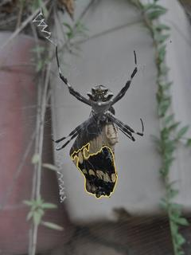 | 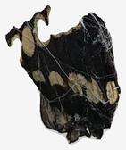 |  `#131212` black · 56,2 % `#322F2B` darkslategray · 16,0 % `#847862` gray · 12,7 % `#5A554B` dimgray · 11,7 % `#B7B5AE` silver · 3,4 % | ***A. argentata*** `011909709e27759a.jpg` score 0,632 97.472 px · 3,10 % © Isaias Maximiliano Churruarin · [CC-BY-NC](https://creativecommons.org/licenses/by-nc/4.0/) · [GBIF](https://www.gbif.org/occurrence/6131413059) |
| 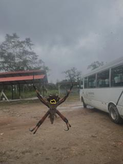 | 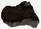 |  `#1E130E` black · 34,3 % `#150C05` black · 31,4 % `#4D493F` dimgray · 13,1 % `#3F3831` darkslategray · 12,6 % `#251D16` black · 8,4 % | ***A. argentata*** `0e20c781f135b0a3.jpg` score 0,558 2.137 px · 0,07 % © ncoole · [CC-BY-NC](https://creativecommons.org/licenses/by-nc/4.0/) · [GBIF](https://www.gbif.org/occurrence/6130188428) |
| 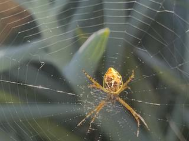 | 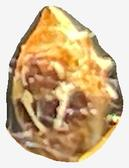 |  `#C19C70` tan · 24,3 % `#EFAE52` sandybrown · 21,3 % `#9A673A` sienna · 20,7 % `#F9E59E` palegoldenrod · 16,9 % `#6A503A` dimgray · 16,8 % | ***A. argentata*** `0feb716791073766.jpg` score 0,966 41.902 px · 1,33 % © seth · [CC-BY-NC](https://creativecommons.org/licenses/by-nc/4.0/) · [GBIF](https://www.gbif.org/occurrence/6147310997) |
| 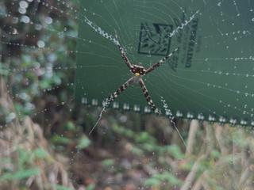 | 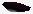 |  `#0D050C` black · 71,4 % `#1C080F` black · 19,0 % `#323036` darkslategray · 3,8 % `#6C6E71` dimgray · 3,3 % `#505055` dimgray · 2,4 % | ***A. argentata*** `10411f5fc991e84d.jpg` score 0,573 210 px · 0,01 % © Owen · [CC-BY-NC](https://creativecommons.org/licenses/by-nc/4.0/) · [GBIF](https://www.gbif.org/occurrence/6171203854) |
| 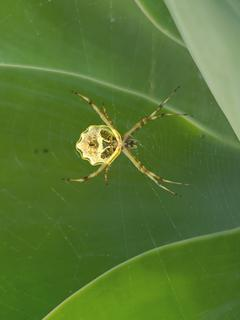 | 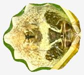 |  `#E4D27D` khaki · 27,2 % `#F5F0B4` palegoldenrod · 24,2 % `#AA9744` darkkhaki · 23,4 % `#665617` darkolivegreen · 17,8 % `#5E8019` olivedrab · 7,4 % | ***A. argentata*** `1045e43ffccba27c.jpg` score 0,960 55.410 px · 1,76 % © forza-natura · [CC-BY-NC](https://creativecommons.org/licenses/by-nc/4.0/) · [GBIF](https://www.gbif.org/occurrence/5938100726) |
| 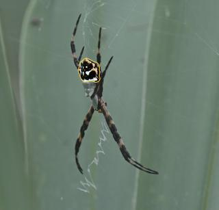 | 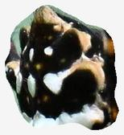 |  `#141310` black · 53,9 % `#554A38` dimgray · 13,1 % `#919D90` darkgray · 12,2 % `#DDE5E4` gainsboro · 12,1 % `#D2B288` tan · 8,6 % | ***A. argentata*** `124b4be4b4f57720.jpg` score 0,929 36.281 px · 0,90 % © Dennis Vollmar · [CC0](https://creativecommons.org/publicdomain/zero/1.0/) · [GBIF](https://www.gbif.org/occurrence/6130531820) |
| 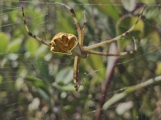 | 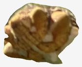 |  `#6E4B1D` saddlebrown · 30,4 % `#573914` saddlebrown · 28,5 % `#7C6842` darkolivegreen · 19,2 % `#B4996B` tan · 11,3 % `#EDCE93` navajowhite · 10,6 % | ***A. argentata*** `242f37a2a3bc816f.jpg` score 0,941 70.366 px · 2,24 % © Bruce Bennett · [CC-BY-NC](https://creativecommons.org/licenses/by-nc/4.0/) · [GBIF](https://www.gbif.org/occurrence/6131467294) |
| 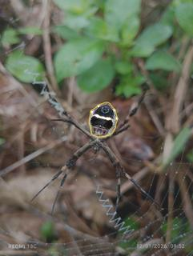 | 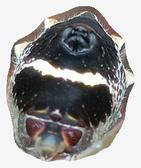 |  `#212124` black · 29,2 % `#454247` darkslategray · 21,9 % `#746762` dimgray · 20,9 % `#A09E97` darkgray · 17,2 % `#EEEEE9` whitesmoke · 10,7 % | ***A. argentata*** `3216d6d62a806e40.jpg` score 0,967 48.987 px · 1,55 % © Dema Domico · [CC-BY-NC](https://creativecommons.org/licenses/by-nc/4.0/) · [GBIF](https://www.gbif.org/occurrence/6130229749) |
| 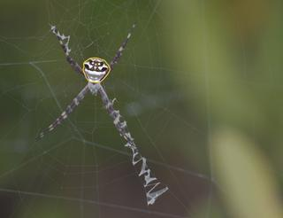 | 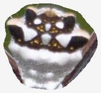 |  `#E7E4E7` gainsboro · 25,4 % `#433434` darkslategray · 24,9 % `#786D6D` dimgray · 21,6 % `#A6A1A2` darkgray · 17,4 % `#5D5C33` darkolivegreen · 10,8 % | ***A. argentata*** `340d7c577c799910.jpg` score 0,932 26.326 px · 0,82 % © Blake Ross · [CC-BY](https://creativecommons.org/licenses/by/4.0/) · [GBIF](https://www.gbif.org/occurrence/6170941348) |
| 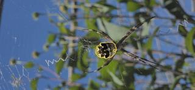 | 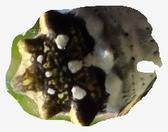 |  `#1A1510` black · 32,8 % `#484032` darkslategray · 30,3 % `#827A60` gray · 19,6 % `#DACE9F` wheat · 9,5 % `#8B9347` darkkhaki · 7,7 % | ***A. argentata*** `3646c7e35eeff3fa.jpg` score 0,928 29.085 px · 1,50 % © Jorgelina · [CC-BY-NC](https://creativecommons.org/licenses/by-nc/4.0/) · [GBIF](https://www.gbif.org/occurrence/6185298851) |
| 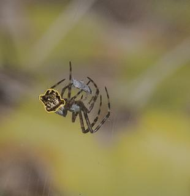 | 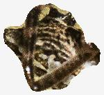 |  `#493924` dimgray · 30,3 % `#261D12` black · 29,7 % `#7A6447` dimgray · 19,5 % `#B7A071` tan · 14,0 % `#D4C8B2` antiquewhite · 6,5 % | ***A. argentata*** `5f6b7fb047432e5c.jpg` score 0,643 11.148 px · 1,00 % © proullard · [CC-BY-NC](https://creativecommons.org/licenses/by-nc/4.0/) · [GBIF](https://www.gbif.org/occurrence/6163050792) |
| 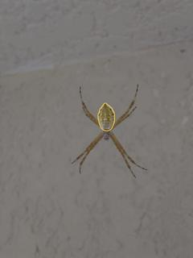 | 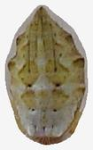 |  `#746537` darkolivegreen · 27,7 % `#887C54` darkolivegreen · 23,7 % `#9A948B` darkgray · 20,2 % `#7A7161` dimgray · 18,7 % `#594527` dimgray · 9,7 % | ***A. argentata*** `66b8aa161b312997.jpg` score 0,958 21.935 px · 0,70 % © Izabel Cavallet · [CC0](https://creativecommons.org/publicdomain/zero/1.0/) · [GBIF](https://www.gbif.org/occurrence/6131399410) |
| 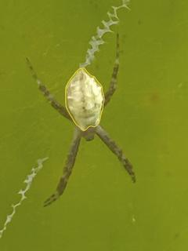 | 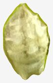 |  `#CEC986` darkkhaki · 33,0 % `#ACA662` darkkhaki · 27,4 % `#EFECB4` palegoldenrod · 22,5 % `#898537` olive · 9,6 % `#A5AB2B` olive · 7,4 % | ***A. argentata*** `6ae7af3ae496797c.jpg` score 0,976 116.904 px · 3,72 % © Júlia M. Alves · [CC-BY-NC](https://creativecommons.org/licenses/by-nc/4.0/) · [GBIF](https://www.gbif.org/occurrence/6185591249) |
| 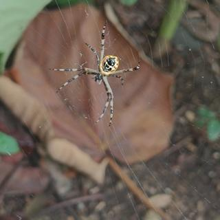 |  |  `#F2EBD8` antiquewhite · 28,3 % `#B7AD9B` darkgray · 21,4 % `#997863` rosybrown · 19,0 % `#5C5C51` dimgray · 17,2 % `#1D1E17` black · 14,1 % | ***A. argentata*** `6c37aacbd8299f53.jpg` score 0,732 22.458 px · 0,54 % © Marco Pecoraro · [CC-BY-NC](https://creativecommons.org/licenses/by-nc/4.0/) · [GBIF](https://www.gbif.org/occurrence/5938210357) |
| 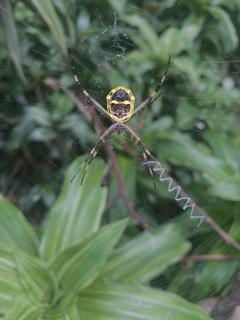 | 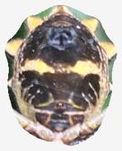 |  `#453D3C` darkslategray · 33,0 % `#736669` dimgray · 21,7 % `#A59783` darkgray · 18,4 % `#DDCEC3` lightgray · 16,7 % `#F8E5A9` palegoldenrod · 10,1 % | ***A. argentata*** `73fc526f84dc4e84.jpg` score 0,961 30.314 px · 0,96 % © sacharita · [CC-BY-NC](https://creativecommons.org/licenses/by-nc/4.0/) · [GBIF](https://www.gbif.org/occurrence/6163227565) |
| 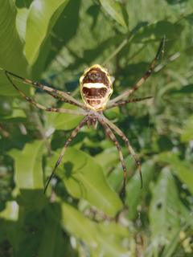 | 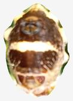 |  `#64381E` saddlebrown · 25,2 % `#EACFA2` wheat · 21,5 % `#7E624A` dimgray · 21,0 % `#B28859` tan · 17,9 % `#FEF8E7` oldlace · 14,4 % | ***A. argentata*** `9898bbadf0ef241f.jpg` score 0,971 69.830 px · 2,22 % © Oldemar Espinoza · [CC-BY-NC](https://creativecommons.org/licenses/by-nc/4.0/) · [GBIF](https://www.gbif.org/occurrence/6159245609) |
| 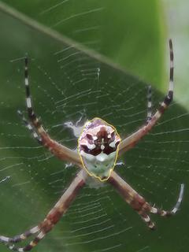 | 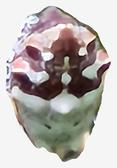 |  `#E1D7DA` gainsboro · 24,1 % `#707762` dimgray · 23,3 % `#442B2C` black · 22,6 % `#A3A79C` darkgray · 16,5 % `#9A7982` rosybrown · 13,5 % | ***A. argentata*** `babe5f8914922fb9.jpg` score 0,963 124.841 px · 3,97 % © Clara Almeida · [CC-BY-NC](https://creativecommons.org/licenses/by-nc/4.0/) · [GBIF](https://www.gbif.org/occurrence/6185209738) |
| 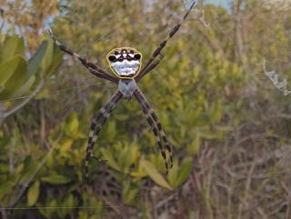 | 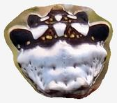 |  `#A4A4B4` darkgray · 24,3 % `#2B1C1F` black · 24,0 % `#E7E1E5` gainsboro · 23,7 % `#9B865F` tan · 15,6 % `#655350` dimgray · 12,5 % | ***A. argentata*** `c3511db4c325fbad.jpg` score 0,966 41.146 px · 1,30 % © Blake Ross · [CC-BY](https://creativecommons.org/licenses/by/4.0/) · [GBIF](https://www.gbif.org/occurrence/6133363340) |
| 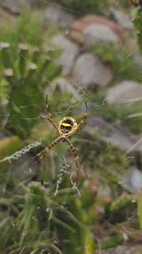 | 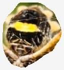 |  `#E4CCA1` wheat · 23,7 % `#685236` dimgray · 23,2 % `#281D14` black · 22,8 % `#A38A52` tan · 21,7 % `#F8D855` goldenrod · 8,6 % | ***A. argentata*** `d222c7992484f41f.jpg` score 0,935 11.239 px · 0,78 % © danapinto_ · [CC-BY-NC](https://creativecommons.org/licenses/by-nc/4.0/) · [GBIF](https://www.gbif.org/occurrence/6479242537) |
| 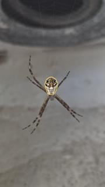 | 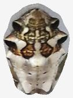 |  `#AAA49D` darkgray · 25,8 % `#5F4E3A` dimgray · 21,3 % `#8E816D` gray · 19,5 % `#D3CBBB` lightgray · 18,9 % `#2D2118` black · 14,5 % | ***A. argentata*** `d88bf8b7b5741e1f.jpg` score 0,956 20.939 px · 0,89 % © Lukas O. de Queiros · [CC-BY-NC](https://creativecommons.org/licenses/by-nc/4.0/) · [GBIF](https://www.gbif.org/occurrence/6185157884) |
| 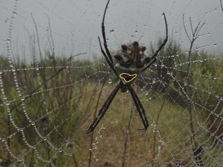 | 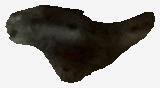 |  `#160F06` black · 34,9 % `#1F190E` black · 28,7 % `#2A261C` black · 17,6 % `#37362C` darkslategray · 14,4 % `#4B4C41` darkslategray · 4,4 % | ***A. argentata*** `db7fc0ff12cf52c3.jpg` score 0,654 6.608 px · 0,21 % © Cneoridium · [CC-BY-NC](https://creativecommons.org/licenses/by-nc/4.0/) · [GBIF](https://www.gbif.org/occurrence/6185034326) |
| 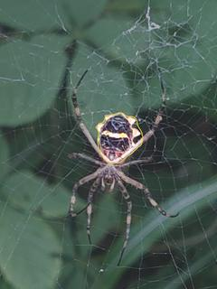 | 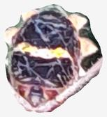 |  `#403444` darkslategray · 30,0 % `#7D6470` dimgray · 23,6 % `#B29EA2` darkgray · 21,8 % `#F1E3E1` mistyrose · 19,9 % `#FBEABB` moccasin · 4,7 % | ***A. argentata*** `e6092e006df2260f.jpg` score 0,957 85.942 px · 2,73 % © Helena · [CC-BY-NC](https://creativecommons.org/licenses/by-nc/4.0/) · [GBIF](https://www.gbif.org/occurrence/6185691601) |
| 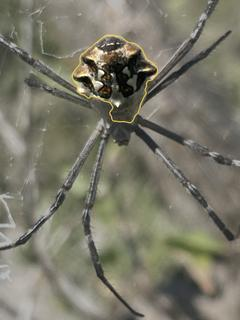 | 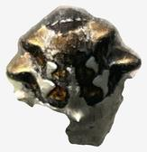 |  `#3B382E` darkslategray · 28,3 % `#13130E` black · 23,4 % `#615B4D` dimgray · 20,8 % `#9F917B` gray · 16,0 % `#DFD2B5` bisque · 11,5 % | ***A. argentata*** `e8348f1d6fa08a20.jpg` score 0,944 189.184 px · 6,01 % © Salvatore Angius · [CC-BY-NC](https://creativecommons.org/licenses/by-nc/4.0/) · [GBIF](https://www.gbif.org/occurrence/6179217653) |
| 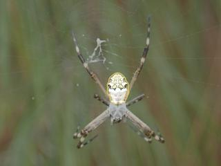 | 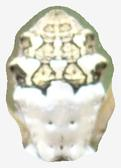 |  `#E5E2CF` antiquewhite · 34,0 % `#F7F8F5` whitesmoke · 27,6 % `#C1BA9E` tan · 17,4 % `#929577` gray · 16,5 % `#686554` dimgray · 4,5 % | ***A. argentata*** `e93682e6de74647c.jpg` score 0,960 45.498 px · 1,45 % © pierrebonmariage · [CC-BY-NC](https://creativecommons.org/licenses/by-nc/4.0/) · [GBIF](https://www.gbif.org/occurrence/6178719753) |
| 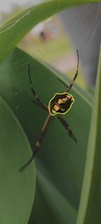 | 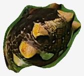 |  `#1D180B` black · 47,1 % `#4F4124` dimgray · 18,6 % `#475D29` darkolivegreen · 14,5 % `#AA8D5B` tan · 13,4 % `#C9993B` darkgoldenrod · 6,4 % | ***A. argentata*** `ebe3e109d13dc5d2.jpg` score 0,967 33.927 px · 1,80 % © emilly2020 · [CC-BY-NC](https://creativecommons.org/licenses/by-nc/4.0/) · [GBIF](https://www.gbif.org/occurrence/6185191764) |
| 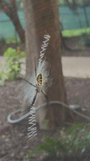 |  |  `#827D70` gray · 24,8 % `#433F41` darkslategray · 23,3 % `#645F5A` dimgray · 22,0 % `#A69E89` darkgray · 18,3 % `#C6C8BD` silver · 11,6 % | ***A. aurantia*** `04b6aa944b6e7c2b.jpg` score 0,889 11.733 px · 0,50 % © christyg2 · [CC-BY-NC](https://creativecommons.org/licenses/by-nc/4.0/) · [GBIF](https://www.gbif.org/occurrence/6400132148) |
|  |  |  `#909577` gray · 23,0 % `#6C7154` dimgray · 22,7 % `#222414` black · 21,9 % `#454930` darkslategray · 21,8 % `#DDE0CD` beige · 10,6 % | ***A. aurantia*** `0bd9aa0e8391caba.jpg` score 0,961 30.716 px · 1,12 % © tom kelley · [CC-BY-NC](https://creativecommons.org/licenses/by-nc/4.0/) · [GBIF](https://www.gbif.org/occurrence/6320350624) |
|  |  |  `#AD9078` rosybrown · 22,1 % `#978580` gray · 21,3 % `#AE9D95` darkgray · 20,0 % `#967A6B` rosybrown · 20,0 % `#7C6B67` dimgray · 16,5 % | ***A. aurantia*** `131191bffe7c4a47.jpg` score 0,981 126.670 px · 3,04 % © Linda Jo Conn · [CC-BY](https://creativecommons.org/licenses/by/4.0/) · [GBIF](https://www.gbif.org/occurrence/6185796589) |
|  |  |  `#906953` rosybrown · 30,7 % `#764D38` sienna · 28,3 % `#5A3321` saddlebrown · 22,0 % `#B18D78` rosybrown · 10,4 % `#30140B` black · 8,6 % | ***A. aurantia*** `2bd679d42401a237.jpg` score 0,585 17.060 px · 0,54 % © Nikolett Tóth · [CC-BY-NC](https://creativecommons.org/licenses/by-nc/4.0/) · [GBIF](https://www.gbif.org/occurrence/6184967729) |
|  |  |  `#F7F2D1` cornsilk · 34,4 % `#CCC6A5` tan · 22,1 % `#979776` tan · 19,0 % `#736A47` darkolivegreen · 16,4 % `#463717` darkolivegreen · 8,1 % | ***A. aurantia*** `2d5d238fab2a11f9.jpg` score 0,940 19.288 px · 0,62 % © chrisbr93 · [CC-BY-NC](https://creativecommons.org/licenses/by-nc/4.0/) · [GBIF](https://www.gbif.org/occurrence/6414043443) |
|  |  |  `#EDEFCF` beige · 33,5 % `#C1C4A2` tan · 21,3 % `#919071` gray · 17,8 % `#635F43` dimgray · 15,5 % `#302816` black · 11,8 % | ***A. aurantia*** `2fa628c877192eb2.jpg` score 0,895 16.325 px · 0,52 % © Madi · [CC-BY-NC](https://creativecommons.org/licenses/by-nc/4.0/) · [GBIF](https://www.gbif.org/occurrence/6352830342) |
|  |  |  `#1D1D18` black · 24,5 % `#6E6E5F` dimgray · 23,4 % `#9A9F8E` darkgray · 21,3 % `#424236` darkslategray · 21,0 % `#D2D5BF` lightgray · 9,8 % | ***A. aurantia*** `4a4b38652ce9013f.jpg` score 0,964 42.625 px · 1,66 % © Misty Keith · [CC-BY-NC](https://creativecommons.org/licenses/by-nc/4.0/) · [GBIF](https://www.gbif.org/occurrence/6422330493) |
|  |  |  `#50513E` dimgray · 22,2 % `#686A56` dimgray · 22,2 % `#363527` darkslategray · 20,1 % `#1D1C13` black · 20,1 % `#828471` gray · 15,5 % | ***A. aurantia*** `55d96b327e1405d7.jpg` score 0,944 30.212 px · 1,28 % © rowanny · [CC-BY-NC](https://creativecommons.org/licenses/by-nc/4.0/) · [GBIF](https://www.gbif.org/occurrence/6195386962) |
|  |  |  `#A9A896` darkgray · 24,5 % `#E2E9D9` beige · 24,0 % `#7A7463` dimgray · 18,7 % `#484237` darkslategray · 17,5 % `#1D1913` black · 15,4 % | ***A. aurantia*** `5ce022b07db9663e.jpg` score 0,970 70.438 px · 2,24 % © hoppy15 · [CC-BY-NC](https://creativecommons.org/licenses/by-nc/4.0/) · [GBIF](https://www.gbif.org/occurrence/6400510743) |
|  |  |  `#9D8F79` gray · 34,8 % `#B9B8AB` silver · 25,7 % `#452B1A` black · 16,2 % `#74614E` dimgray · 15,6 % `#7D5330` sienna · 7,7 % | ***A. aurantia*** `5d24cf8b6bfe5c6c.jpg` score 0,938 23.221 px · 0,83 % © Dave Suszcynsky · [CC-BY-NC](https://creativecommons.org/licenses/by-nc/4.0/) · [GBIF](https://www.gbif.org/occurrence/6413763800) |
|  |  |  `#432416` black · 33,9 % `#573425` dimgray · 28,8 % `#6F4837` dimgray · 19,4 % `#7C6153` dimgray · 13,1 % `#978680` gray · 4,8 % | ***A. aurantia*** `5e44cc99ffe4cd91.jpg` score 0,955 214.110 px · 7,44 % © Carolyn Caywood · [CC-BY-NC](https://creativecommons.org/licenses/by-nc/4.0/) · [GBIF](https://www.gbif.org/occurrence/6184885277) |
|  |  |  `#1F1B15` black · 24,8 % `#B5B9AF` silver · 23,4 % `#84846A` gray · 23,4 % `#504C3C` dimgray · 19,2 % `#C9CDA1` wheat · 9,2 % | ***A. aurantia*** `7a2b1daf26281800.jpg` score 0,944 15.783 px · 0,50 % © tbluett · [CC-BY-NC](https://creativecommons.org/licenses/by-nc/4.0/) · [GBIF](https://www.gbif.org/occurrence/6399186467) |
|  |  |  `#F3F6E6` ivory · 26,9 % `#625A4C` dimgray · 19,0 % `#918D7A` gray · 18,7 % `#242323` black · 18,1 % `#BFC0AB` silver · 17,4 % | ***A. aurantia*** `7ec0f5b096cf7676.jpg` score 0,655 30.637 px · 0,97 % © Max · [CC-BY-NC](https://creativecommons.org/licenses/by-nc/4.0/) · [GBIF](https://www.gbif.org/occurrence/6321112759) |
|  |  |  `#323532` darkslategray · 50,0 % `#4D4E45` dimgray · 21,7 % `#AAAA9F` darkgray · 13,2 % `#7A796A` gray · 11,7 % `#B2AA7C` tan · 3,3 % | ***A. aurantia*** `817d6255d3a09113.jpg` score 0,922 14.905 px · 0,47 % © praishja · [CC-BY-NC](https://creativecommons.org/licenses/by-nc/4.0/) · [GBIF](https://www.gbif.org/occurrence/6400029417) |
|  |  |  `#9A968B` darkgray · 24,0 % `#786D5C` dimgray · 23,2 % `#BCBEBC` silver · 21,6 % `#514436` dimgray · 17,8 % `#1D1915` black · 13,3 % | ***A. aurantia*** `8375845b78d249f0.jpg` score 0,974 117.475 px · 4,20 % © Maximillion (max) Cipov · [CC-BY-NC](https://creativecommons.org/licenses/by-nc/4.0/) · [GBIF](https://www.gbif.org/occurrence/6163170021) |
|  |  |  `#DADAE8` lavender · 31,7 % `#BBBAC4` silver · 27,3 % `#EFF4FA` aliceblue · 18,6 % `#938F98` gray · 14,3 % `#5C5760` dimgray · 8,1 % | ***A. aurantia*** `8da67ac846422946.jpg` score 0,960 55.283 px · 1,76 % © aeheerema · [CC-BY-NC](https://creativecommons.org/licenses/by-nc/4.0/) · [GBIF](https://www.gbif.org/occurrence/6235233277) |
|  |  |  `#716E44` darkolivegreen · 25,9 % `#918F69` tan · 22,7 % `#4D481D` darkolivegreen · 20,6 % `#B8B594` tan · 18,4 % `#DDDFC2` beige · 12,3 % | ***A. aurantia*** `92130bec53fde47a.jpg` score 0,914 3.891 px · 0,49 % © Megan Kossa · [CC-BY](https://creativecommons.org/licenses/by/4.0/) · [GBIF](https://www.gbif.org/occurrence/6399675153) |
|  |  |  `#988675` gray · 30,8 % `#B2A190` darkgray · 23,0 % `#796D61` dimgray · 17,6 % `#7F6450` dimgray · 15,6 % `#584A3F` dimgray · 13,1 % | ***A. aurantia*** `9a825c65d833b2a9.jpg` score 0,761 16.373 px · 0,52 % © cpanda · [CC-BY-NC](https://creativecommons.org/licenses/by-nc/4.0/) · [GBIF](https://www.gbif.org/occurrence/6147462924) |
|  |  |  `#ACB6C6` lightsteelblue · 36,5 % `#828798` lightslategray · 23,1 % `#99A39D` darkgray · 17,4 % `#565561` dimgray · 12,7 % `#2B2331` black · 10,3 % | ***A. aurantia*** `9c2b1b5453ac0d37.jpg` score 0,959 38.383 px · 1,22 % © polkcountymike · [CC-BY-NC](https://creativecommons.org/licenses/by-nc/4.0/) · [GBIF](https://www.gbif.org/occurrence/6234242280) |
|  |  |  `#EEE9E1` linen · 39,5 % `#291C17` black · 25,9 % `#B1A596` darkgray · 14,4 % `#69594F` dimgray · 12,4 % `#607A2D` darkolivegreen · 7,8 % | ***A. aurantia*** `a45c890d4dc723ef.jpg` score 0,970 14.676 px · 1,33 % © Shinobu · [CC-BY](https://creativecommons.org/licenses/by/4.0/) · [GBIF](https://www.gbif.org/occurrence/6413596964) |
|  |  |  `#BCC1B7` silver · 33,6 % `#DEE3DF` gainsboro · 31,5 % `#A29E90` darkgray · 22,3 % `#7B6F5E` dimgray · 8,3 % `#7B9A74` darkseagreen · 4,3 % | ***A. aurantia*** `cdfaeff27f20c538.jpg` score 0,958 15.143 px · 1,09 % © John Serrao · [CC-BY-NC](https://creativecommons.org/licenses/by-nc/4.0/) · [GBIF](https://www.gbif.org/occurrence/6399743477) |
|  |  |  `#AA9672` tan · 27,4 % `#84704C` darkolivegreen · 23,5 % `#D0BC97` tan · 22,0 % `#594B27` darkolivegreen · 18,1 % `#352A14` black · 9,2 % | ***A. aurantia*** `ced10dfeb081ce47.jpg` score 0,981 275.163 px · 8,75 % © Jo Ann Cosbey · [CC-BY-NC](https://creativecommons.org/licenses/by-nc/4.0/) · [GBIF](https://www.gbif.org/occurrence/6252739885) |
|  |  |  `#94A987` darkseagreen · 49,9 % `#798C60` darkolivegreen · 22,8 % `#98B07B` darkseagreen · 12,8 % `#5E6F48` darkolivegreen · 10,5 % `#545D4F` dimgray · 4,0 % | ***A. aurantia*** `d6d17e057d9c3dbc.jpg` score 0,660 50.349 px · 1,60 % © Mariah McVey · [CC-BY-NC](https://creativecommons.org/licenses/by-nc/4.0/) · [GBIF](https://www.gbif.org/occurrence/6398833609) |
|  |  |  `#726A55` dimgray · 26,4 % `#453C2B` darkslategray · 23,9 % `#13110B` black · 21,3 % `#A49C85` darkgray · 19,0 % `#DFE2C5` beige · 9,4 % | ***A. aurantia*** `e2d5cb14c86cde5f.jpg` score 0,640 15.980 px · 0,51 % © naturedude1964 · [CC-BY-NC](https://creativecommons.org/licenses/by-nc/4.0/) · [GBIF](https://www.gbif.org/occurrence/6399672686) |
|  |  |  `#D4D4C2` lightgray · 29,6 % `#B2AD93` tan · 29,1 % `#9E9160` tan · 23,0 % `#726225` darkolivegreen · 13,8 % `#386017` darkolivegreen · 4,4 % | ***A. aurantia*** `e6717a8418dd7a6f.jpg` score 0,977 150.298 px · 4,78 % © wingbar · [CC-BY-NC](https://creativecommons.org/licenses/by-nc/4.0/) · [GBIF](https://www.gbif.org/occurrence/6188061603) |
|  |  |  `#BF8867` darksalmon · 24,0 % `#9D807E` rosybrown · 22,5 % `#EABD8E` burlywood · 22,0 % `#9E5C4A` sienna · 20,2 % `#69403E` dimgray · 11,3 % | ***A. aurantia*** `e6e26328d1a07593.jpg` score 0,660 26.767 px · 0,85 % © Braden Wojahn · [CC-BY-NC](https://creativecommons.org/licenses/by-nc/4.0/) · [GBIF](https://www.gbif.org/occurrence/6159182477) |
|  |  |  `#E6DAB8` wheat · 35,9 % `#B4A694` darkgray · 26,6 % `#F8F4EB` floralwhite · 23,9 % `#BAB5C4` silver · 10,1 % `#784A66` dimgray · 3,5 % | ***A. bruennichi*** `00f57889195ba0ba.jpg` score 0,977 76.145 px · 2,20 % © Daniele Gatti · [CC-BY-NC](https://creativecommons.org/licenses/by-nc/4.0/) · [GBIF](https://www.gbif.org/occurrence/6479166919) |
|  |  |  `#E4E0A0` palegoldenrod · 27,2 % `#D9D380` khaki · 25,1 % `#B6AF81` tan · 18,6 % `#7D8A52` darkolivegreen · 14,9 % `#E3E0BE` blanchedalmond · 14,1 % | ***A. bruennichi*** `08b4ed69f881d323.jpg` score 0,959 7.298 px · 1,09 % © User 202365 · [CC-BY-NC](https://creativecommons.org/licenses/by-nc/4.0/) · [GBIF](https://www.gbif.org/occurrence/6447794500) |
|  |  |  `#9F8658` tan · 28,3 % `#C6B57E` tan · 22,0 % `#725B39` dimgray · 21,9 % `#433527` darkslategray · 16,4 % `#F9EE7F` khaki · 11,4 % | ***A. bruennichi*** `0a4b7bf88a5f513d.jpg` score 0,976 12.731 px · 1,69 % © User 230217 · [CC-BY-NC](https://creativecommons.org/licenses/by-nc/4.0/) · [GBIF](https://www.gbif.org/occurrence/6423712770) |
|  |  |  `#5C311B` saddlebrown · 30,8 % `#835435` sienna · 26,6 % `#A57C5B` rosybrown · 20,2 % `#4E3A33` dimgray · 12,6 % `#CEAF91` tan · 9,7 % | ***A. bruennichi*** `1e7f5dfe52d7a75d.jpg` score 0,686 1.325 px · 0,04 % © iv_ro · [CC-BY-NC](https://creativecommons.org/licenses/by-nc/4.0/) · [GBIF](https://www.gbif.org/occurrence/6479213921) |
|  |  |  `#756F40` darkolivegreen · 32,8 % `#564A29` darkolivegreen · 29,7 % `#9C9559` darkkhaki · 21,5 % `#2D2613` black · 11,7 % `#7B903B` olivedrab · 4,3 % | ***A. bruennichi*** `26c84f9404f56547.jpg` score 0,925 8.412 px · 0,84 % © User 1291889 · [CC-BY-NC](https://creativecommons.org/licenses/by-nc/4.0/) · [GBIF](https://www.gbif.org/occurrence/6424172312) |
|  |  |  `#706C37` darkolivegreen · 32,9 % `#898852` darkolivegreen · 26,0 % `#5B511F` darkolivegreen · 17,9 % `#ADA572` tan · 11,7 % `#948054` tan · 11,4 % | ***A. bruennichi*** `35f04bdbce178408.jpg` score 0,972 19.881 px · 1,99 % © User 767098 · [CC-BY-NC](https://creativecommons.org/licenses/by-nc/4.0/) · [GBIF](https://www.gbif.org/occurrence/6424090543) |
|  |  |  `#72685B` dimgray · 29,5 % `#928D7F` gray · 28,8 % `#4C3C2E` dimgray · 15,6 % `#B2B4B1` darkgray · 14,7 % `#C5C9AB` wheat · 11,4 % | ***A. bruennichi*** `3610e6ff17c14ec0.jpg` score 0,975 31.094 px · 3,11 % © User 373902 · [CC-BY-NC](https://creativecommons.org/licenses/by-nc/4.0/) · [GBIF](https://www.gbif.org/occurrence/6424266519) |
|  |  |  `#EDEEE3` linen · 31,5 % `#DBD8BD` antiquewhite · 26,6 % `#C7C8C1` silver · 19,8 % `#ACAA98` darkgray · 15,9 % `#6F7366` dimgray · 6,2 % | ***A. bruennichi*** `3b75dee19792b37f.jpg` score 0,965 37.896 px · 1,35 % © Julien Tchilinguirian · [CC-BY](https://creativecommons.org/licenses/by/4.0/) · [GBIF](https://www.gbif.org/occurrence/6441260972) |
|  |  |  `#A1958B` darkgray · 26,4 % `#837A74` gray · 22,0 % `#443D41` darkslategray · 21,7 % `#60585A` dimgray · 16,9 % `#B0AEB2` darkgray · 12,9 % | ***A. bruennichi*** `40417d09891073b3.jpg` score 0,976 20.349 px · 2,03 % © User 970325 · [CC-BY-NC](https://creativecommons.org/licenses/by-nc/4.0/) · [GBIF](https://www.gbif.org/occurrence/6410872684) |
|  |  |  `#E8D9DE` gainsboro · 23,1 % `#B7A5A6` darkgray · 22,8 % `#574445` dimgray · 22,8 % `#857374` gray · 19,3 % `#2D1A1C` black · 12,0 % | ***A. bruennichi*** `4645418fc51d751b.jpg` score 0,981 25.880 px · 2,59 % © User 994349 · [CC-BY-NC](https://creativecommons.org/licenses/by-nc/4.0/) · [GBIF](https://www.gbif.org/occurrence/6424513450) |
|  |  |  `#EEEFC6` lightgoldenrodyellow · 27,6 % `#BCBDA0` tan · 22,6 % `#8B8A6C` gray · 22,0 % `#615B44` dimgray · 15,4 % `#A2AE7A` darkseagreen · 12,4 % | ***A. bruennichi*** `56240195db4670d7.jpg` score 0,966 9.876 px · 1,32 % © User 936795 · [CC-BY-NC](https://creativecommons.org/licenses/by-nc/4.0/) · [GBIF](https://www.gbif.org/occurrence/6423570617) |
|  |  |  `#C0AE7B` tan · 32,5 % `#DAC9A2` wheat · 27,7 % `#646245` dimgray · 15,7 % `#999070` tan · 13,7 % `#917F4D` darkolivegreen · 10,4 % | ***A. bruennichi*** `5650437e41cc008a.jpg` score 0,969 7.051 px · 0,94 % © User 960907 · [CC-BY-NC](https://creativecommons.org/licenses/by-nc/4.0/) · [GBIF](https://www.gbif.org/occurrence/6411204794) |
|  |  |  `#E4E3D9` gainsboro · 27,6 % `#D0CAAD` wheat · 26,4 % `#B3A573` tan · 17,1 % `#A9A390` darkgray · 15,9 % `#806F50` dimgray · 13,0 % | ***A. bruennichi*** `5e56b2f436a1e3cc.jpg` score 0,979 30.049 px · 2,34 % © 05gi02el03 · [CC-BY-NC](https://creativecommons.org/licenses/by-nc/4.0/) · [GBIF](https://www.gbif.org/occurrence/6413133456) |
|  |  |  `#F8F7AD` palegoldenrod · 35,3 % `#F4F4C7` lemonchiffon · 26,6 % `#C5BE8F` tan · 17,2 % `#928661` tan · 12,4 % `#5A4B33` dimgray · 8,5 % | ***A. bruennichi*** `601b8dc2e6b61421.jpg` score 0,982 22.229 px · 2,96 % © User 1079341 · [CC-BY-NC](https://creativecommons.org/licenses/by-nc/4.0/) · [GBIF](https://www.gbif.org/occurrence/6423826657) |
|  |  |  `#798455` darkolivegreen · 30,0 % `#94A16C` darkseagreen · 20,0 % `#869072` gray · 19,4 % `#5B6742` darkolivegreen · 17,3 % `#ACB798` darkseagreen · 13,3 % | ***A. bruennichi*** `67f6841696ab7934.jpg` score 0,973 21.614 px · 2,16 % © User 782392 · [CC-BY-NC](https://creativecommons.org/licenses/by-nc/4.0/) · [GBIF](https://www.gbif.org/occurrence/6410867480) |
|  |  |  `#B9956F` tan · 22,4 % `#91704D` rosybrown · 20,8 % `#965239` sienna · 20,7 % `#E1C6A0` tan · 19,3 % `#5B3824` saddlebrown · 16,8 % | ***A. bruennichi*** `6d4314bcc41b5254.jpg` score 0,963 6.832 px · 0,68 % © User 156924 · [CC-BY-NC](https://creativecommons.org/licenses/by-nc/4.0/) · [GBIF](https://www.gbif.org/occurrence/6423765521) |
|  |  |  `#7C7024` olive · 35,5 % `#B49B46` darkkhaki · 22,0 % `#F3E26F` khaki · 15,8 % `#523A0C` saddlebrown · 13,6 % `#E7DCA0` palegoldenrod · 13,0 % | ***A. bruennichi*** `8cc7e53bf82ee66c.jpg` score 0,971 67.390 px · 2,14 % © Sieglinde Meyer Puntscher · [CC-BY-NC](https://creativecommons.org/licenses/by-nc/4.0/) · [GBIF](https://www.gbif.org/occurrence/6431074533) |
|  |  |  `#C6C9AA` wheat · 25,6 % `#90936A` tan · 24,2 % `#5D6035` darkolivegreen · 24,1 % `#7D8B43` darkolivegreen · 14,8 % `#2B2D11` black · 11,3 % | ***A. bruennichi*** `96f8c0e7a5c221f1.jpg` score 0,975 12.507 px · 1,67 % © User 189810 · [CC-BY-NC](https://creativecommons.org/licenses/by-nc/4.0/) · [GBIF](https://www.gbif.org/occurrence/6424491312) |
|  |  |  `#E7CD06` gold · 34,9 % `#C2B10A` goldenrod · 23,8 % `#9A9817` olive · 16,2 % `#737E1D` olive · 14,5 % `#586926` darkolivegreen · 10,6 % | ***A. bruennichi*** `9a661f55ff3a2338.jpg` score 0,945 7.025 px · 0,70 % © User 199809 · [CC-BY-NC](https://creativecommons.org/licenses/by-nc/4.0/) · [GBIF](https://www.gbif.org/occurrence/6341960374) |
|  |  |  `#9D8585` rosybrown · 30,8 % `#BAA4AD` darkgray · 28,5 % `#70625D` dimgray · 23,2 % `#4C423E` dimgray · 9,5 % `#1B1A14` black · 8,0 % | ***A. bruennichi*** `9b1e4f289b36fd25.jpg` score 0,931 24.244 px · 0,87 % © Kristof Wührer · [CC-BY-NC](https://creativecommons.org/licenses/by-nc/4.0/) · [GBIF](https://www.gbif.org/occurrence/6185212768) |
|  |  |  `#C6B27E` tan · 25,2 % `#ECDCA8` wheat · 22,6 % `#B6A491` darkgray · 21,5 % `#DDD5C4` antiquewhite · 20,5 % `#8B6F50` dimgray · 10,1 % | ***A. bruennichi*** `9cfa1cb61db972b3.jpg` score 0,974 35.049 px · 3,50 % © User 1075494 · [CC-BY-NC](https://creativecommons.org/licenses/by-nc/4.0/) · [GBIF](https://www.gbif.org/occurrence/6424296645) |
|  |  |  `#534611` darkolivegreen · 27,3 % `#716514` olive · 24,6 % `#2F290A` black · 24,0 % `#938C1F` olive · 14,3 % `#C5BA22` goldenrod · 9,8 % | ***A. bruennichi*** `a27b843012508fd9.jpg` score 0,951 12.125 px · 2,15 % © User 860497 · [CC-BY-NC](https://creativecommons.org/licenses/by-nc/4.0/) · [GBIF](https://www.gbif.org/occurrence/6423607738) |
|  |  |  `#94946D` tan · 24,5 % `#C3C291` tan · 22,5 % `#252519` black · 19,2 % `#5A5C41` dimgray · 17,2 % `#D5D7C5` lightgray · 16,6 % | ***A. bruennichi*** `a2fc5c202a10dab0.jpg` score 0,968 44.127 px · 1,58 % © harry beaman · [CC-BY](https://creativecommons.org/licenses/by/4.0/) · [GBIF](https://www.gbif.org/occurrence/6413912548) |
|  |  |  `#4D3E2D` dimgray · 41,3 % `#211D17` black · 22,3 % `#8D6A4E` rosybrown · 19,6 % `#6B713C` darkolivegreen · 8,8 % `#D7C78E` burlywood · 8,0 % | ***A. bruennichi*** `a9fb4a103310693e.jpg` score 0,958 8.020 px · 1,07 % © User 123534 · [CC-BY-NC](https://creativecommons.org/licenses/by-nc/4.0/) · [GBIF](https://www.gbif.org/occurrence/6424230481) |
|  |  |  `#DAD79A` palegoldenrod · 22,8 % `#929A81` darkgray · 22,6 % `#D9D8B3` wheat · 19,5 % `#ABA877` tan · 17,5 % `#716D59` dimgray · 17,5 % | ***A. bruennichi*** `aadea17b216b658b.jpg` score 0,966 5.420 px · 0,72 % © User 1202677 · [CC-BY-NC](https://creativecommons.org/licenses/by-nc/4.0/) · [GBIF](https://www.gbif.org/occurrence/6412375694) |
|  |  |  `#A8A36B` darkkhaki · 27,8 % `#EAE7BA` lemonchiffon · 23,6 % `#EAE287` khaki · 21,1 % `#6D6534` darkolivegreen · 17,7 % `#221B07` black · 9,8 % | ***A. bruennichi*** `afedd500df72ae16.jpg` score 0,985 73.953 px · 7,40 % © User 991876 · [CC-BY-NC](https://creativecommons.org/licenses/by-nc/4.0/) · [GBIF](https://www.gbif.org/occurrence/6424000656) |
|  |  |  `#B9BBA0` silver · 22,3 % `#878D78` gray · 21,2 % `#E6E4B3` palegoldenrod · 21,2 % `#31322C` darkslategray · 20,9 % `#5A5A4B` dimgray · 14,4 % | ***A. bruennichi*** `c6726664e01fb407.jpg` score 0,983 41.645 px · 4,16 % © User 1240336 · [CC-BY-NC](https://creativecommons.org/licenses/by-nc/4.0/) · [GBIF](https://www.gbif.org/occurrence/6424625729) |
|  |  |  `#F7F2A8` palegoldenrod · 27,8 % `#54481A` darkolivegreen · 21,2 % `#867D41` darkolivegreen · 21,2 % `#252009` black · 17,1 % `#C1B176` darkkhaki · 12,7 % | ***A. bruennichi*** `ce285fafdfd82efb.jpg` score 0,933 6.318 px · 1,37 % © User 1095073 · [CC-BY-NC](https://creativecommons.org/licenses/by-nc/4.0/) · [GBIF](https://www.gbif.org/occurrence/6424303485) |
|  |  |  `#B1B78B` darkseagreen · 29,0 % `#E3E7B9` lightgoldenrodyellow · 25,8 % `#838865` gray · 20,6 % `#564E35` dimgray · 13,7 % `#221C10` black · 11,0 % | ***A. bruennichi*** `f459a6e224e410e1.jpg` score 0,913 15.036 px · 1,50 % © User 1045765 · [CC-BY-NC](https://creativecommons.org/licenses/by-nc/4.0/) · [GBIF](https://www.gbif.org/occurrence/6424176701) |
|  |  |  `#74855B` darkolivegreen · 22,4 % `#A8BD97` darkseagreen · 21,0 % `#D7E5AB` palegoldenrod · 20,5 % `#91B062` darkkhaki · 20,0 % `#465535` darkolivegreen · 16,1 % | ***A. bruennichi*** `f6f4652284a4fdfa.jpg` score 0,952 5.789 px · 0,77 % © User 1261476 · [CC-BY-NC](https://creativecommons.org/licenses/by-nc/4.0/) · [GBIF](https://www.gbif.org/occurrence/6423701454) |

## Las 19 sin máscara

El U-Net no devolvió ningún píxel. El adaptador lo registra como `skip` con su motivo en `skipped.csv` en vez de pasar una región vacía aguas abajo — pero es un fallo real del modelo, no un detalle de contabilidad.

| Especie | Imagen |
|---|---|
| *A. argentata* | `0e680af89364aa64.jpg` |
| *A. argentata* | `1bebac7d6e90fe4e.jpg` |
| *A. argentata* | `1c12a64143bd7760.jpg` |
| *A. argentata* | `448b61f3e3a692ac.jpg` |
| *A. argentata* | `aafcf842c5581eb0.jpg` |
| *A. argentata* | `abdf7ea9809a9230.jpg` |
| *A. argentata* | `c06565d8eb972de2.jpg` |
| *A. argentata* | `dcdbd5aa2d0715aa.jpg` |
| *A. argentata* | `f9811618a7507156.jpg` |
| *A. aurantia* | `75e6c4f3263e976b.jpg` |
| *A. aurantia* | `7b5bbeac4b2032b5.jpg` |
| *A. aurantia* | `981196830e906fe2.jpg` |
| *A. aurantia* | `b938e737e84f50bc.jpg` |
| *A. aurantia* | `e789afcdeec1cc42.jpg` |
| *A. aurantia* | `f14834ec301bb911.jpg` |
| *A. aurantia* | `f34b4f92e1afcc94.jpg` |
| *A. aurantia* | `f7807ad5593c8bbe.jpg` |
| *A. bruennichi* | `888983a1cce76e33.jpg` |
| *A. bruennichi* | `ffc53159e8c9b532.jpg` |

---

Generado por `repro/segmentr/adapt_unet.py` (run `unseen100`). Reproducible desde `run_config.json`. Los colores se reportan como HEX, coordenadas Lab y cobertura: no se afirma compatibilidad con PANTONE®.
