# Galería — máscaras y pantones sobre 100 imágenes inéditas

Las etapas de *SegmentR* que sobrevivieron a la réplica — color CIELAB, artefacto JSON, QA y recortes — alimentadas por el segmentador U-Net de Argiope en lugar de GroundedSAM.

- **73 de 100** imágenes producen máscara de opistosoma; **27** no devuelven ningún píxel.
- Muestreo estratificado por especie sobre `data/raw/gbif`, **sin solape** con las 150 imágenes anotadas para entrenar (verificado con aserciones).
- Sin ground truth: aquí no hay IoU. La medida con anotaciones es otra — IoU 0,765 mediano sobre el held-out, y color indistinguible del de la máscara a mano (ΔE 1,51) donde IoU ≥ 0,7.

> **Con máscara no quiere decir correcta.** De 18 fichas inspeccionadas a ojo, 17 son opistosomas claros y una (`0e680af89364aa64.jpg`) es una **hoja**. La auditoría es parcial y no se extrapola.

La versión interactiva, con la distribución de áreas y la tabla por especie, está en [`galeria.html`](galeria.html) (GitHub no renderiza HTML en el navegador del repo: descárgalo, o sírvelo con GitHub Pages).

## Procedencia de las fotografías

Cada fotografía es de terceros, obtenida vía GBIF, y se reproduce aquí **con atribución** bajo su licencia Creative Commons. Créditos por imagen en la última columna de cada fila.

| Licencia | Imágenes |
|---|---:|
| [CC-BY-NC](https://creativecommons.org/licenses/by-nc/4.0/) | 65 |
| [CC-BY](https://creativecommons.org/licenses/by/4.0/) | 6 |
| [CC0](https://creativecommons.org/publicdomain/zero/1.0/) | 2 |

`CC-BY-NC` no permite uso comercial. Las máscaras y paletas derivadas son resultado de este análisis; las fotografías siguen siendo de sus autores.

## Las 73 con máscara

Foto con el contorno de la máscara en amarillo y el fondo atenuado · el opistosoma recortado · la paleta que extrajo la etapa E (barra proporcional a la cobertura).

| Foto | Opistosoma | Pantone | Datos y crédito |
|---|---|---|---|
|  |  |  `#15100D` black · 34,7 % `#443E35` darkslategray · 18,8 % `#A5A8A7` darkgray · 18,7 % `#6F6E68` dimgray · 13,9 % `#DEE5E7` gainsboro · 13,9 % | ***A. argentata*** `011909709e27759a.jpg` score 0,793 5.067 px · 0,16 % © Isaias Maximiliano Churruarin · [CC-BY-NC](https://creativecommons.org/licenses/by-nc/4.0/) · [GBIF](https://www.gbif.org/occurrence/6131413059) |
| 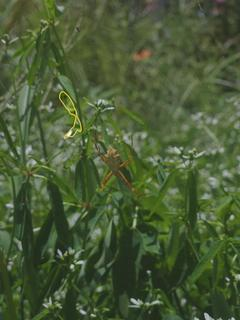 | 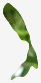 |  `#3D581B` darkolivegreen · 39,1 % `#638035` darkolivegreen · 32,4 % `#7FA138` olivedrab · 11,0 % `#758D62` darkolivegreen · 10,9 % `#D8E1D9` gainsboro · 6,6 % | ***A. argentata*** `0e680af89364aa64.jpg` score 0,691 13.316 px · 0,42 % © Mateus Fernandes · [CC-BY-NC](https://creativecommons.org/licenses/by-nc/4.0/) · [GBIF](https://www.gbif.org/occurrence/6179563636) |
|  |  |  `#C59F73` tan · 23,4 % `#F0AF53` sandybrown · 21,7 % `#9F6B3D` sienna · 21,2 % `#705139` dimgray · 16,9 % `#F9E5A0` palegoldenrod · 16,8 % | ***A. argentata*** `0feb716791073766.jpg` score 0,961 37.118 px · 1,18 % © seth · [CC-BY-NC](https://creativecommons.org/licenses/by-nc/4.0/) · [GBIF](https://www.gbif.org/occurrence/6147310997) |
|  |  |  `#E5D27E` khaki · 28,5 % `#F6F2B5` palegoldenrod · 26,1 % `#A79549` darkkhaki · 19,7 % `#645516` darkolivegreen · 18,0 % `#597E16` olivedrab · 7,7 % | ***A. argentata*** `1045e43ffccba27c.jpg` score 0,969 44.491 px · 1,41 % © forza-natura · [CC-BY-NC](https://creativecommons.org/licenses/by-nc/4.0/) · [GBIF](https://www.gbif.org/occurrence/5938100726) |
|  |  |  `#14120F` black · 51,7 % `#909D90` darkgray · 14,3 % `#52493A` dimgray · 13,9 % `#DBE3E2` gainsboro · 13,2 % `#CBA87C` tan · 6,9 % | ***A. argentata*** `124b4be4b4f57720.jpg` score 0,923 39.150 px · 0,97 % © Dennis Vollmar · [CC0](https://creativecommons.org/publicdomain/zero/1.0/) · [GBIF](https://www.gbif.org/occurrence/6130531820) |
| 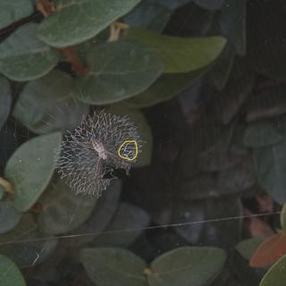 | 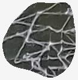 |  `#40423E` darkslategray · 49,9 % `#292B29` black · 13,3 % `#606160` dimgray · 13,3 % `#8A8B8A` gray · 12,8 % `#B3B3B4` darkgray · 10,7 % | ***A. argentata*** `1c12a64143bd7760.jpg` score 0,861 11.968 px · 0,32 % © Heytor Lisboa · [CC-BY-NC](https://creativecommons.org/licenses/by-nc/4.0/) · [GBIF](https://www.gbif.org/occurrence/6159438388) |
|  |  |  `#72501D` saddlebrown · 33,5 % `#634214` saddlebrown · 29,2 % `#54310C` saddlebrown · 15,3 % `#6F582F` darkolivegreen · 13,3 % `#85704C` dimgray · 8,7 % | ***A. argentata*** `242f37a2a3bc816f.jpg` score 0,853 10.871 px · 0,35 % © Bruce Bennett · [CC-BY-NC](https://creativecommons.org/licenses/by-nc/4.0/) · [GBIF](https://www.gbif.org/occurrence/6131467294) |
|  |  |  `#222123` black · 28,4 % `#464246` darkslategray · 21,6 % `#746964` dimgray · 20,0 % `#A19E96` darkgray · 18,8 % `#E8E8E5` gainsboro · 11,1 % | ***A. argentata*** `3216d6d62a806e40.jpg` score 0,968 54.504 px · 1,73 % © Dema Domico · [CC-BY-NC](https://creativecommons.org/licenses/by-nc/4.0/) · [GBIF](https://www.gbif.org/occurrence/6130229749) |
|  |  |  `#423334` darkslategray · 28,2 % `#E7E4E7` gainsboro · 24,3 % `#786C6D` dimgray · 23,7 % `#A7A1A2` darkgray · 15,4 % `#655D37` darkolivegreen · 8,3 % | ***A. argentata*** `340d7c577c799910.jpg` score 0,947 22.438 px · 0,70 % © Blake Ross · [CC-BY](https://creativecommons.org/licenses/by/4.0/) · [GBIF](https://www.gbif.org/occurrence/6170941348) |
|  |  |  `#1A130D` black · 41,2 % `#473B26` darkslategray · 20,9 % `#867E68` gray · 18,1 % `#DDD2A4` wheat · 13,0 % `#7B8638` darkolivegreen · 6,7 % | ***A. argentata*** `3646c7e35eeff3fa.jpg` score 0,888 9.278 px · 0,48 % © Jorgelina · [CC-BY-NC](https://creativecommons.org/licenses/by-nc/4.0/) · [GBIF](https://www.gbif.org/occurrence/6185298851) |
|  |  |  `#2C2215` black · 32,1 % `#5B472F` dimgray · 26,4 % `#957F59` tan · 19,0 % `#BAA762` darkkhaki · 16,4 % `#CFC1A9` tan · 6,1 % | ***A. argentata*** `5f6b7fb047432e5c.jpg` score 0,930 20.314 px · 1,82 % © proullard · [CC-BY-NC](https://creativecommons.org/licenses/by-nc/4.0/) · [GBIF](https://www.gbif.org/occurrence/6163050792) |
|  |  |  `#756537` darkolivegreen · 26,1 % `#897C53` darkolivegreen · 24,1 % `#9B958C` darkgray · 23,0 % `#7B7262` dimgray · 17,8 % `#594528` dimgray · 9,1 % | ***A. argentata*** `66b8aa161b312997.jpg` score 0,960 24.732 px · 0,79 % © Izabel Cavallet · [CC0](https://creativecommons.org/publicdomain/zero/1.0/) · [GBIF](https://www.gbif.org/occurrence/6131399410) |
|  |  |  `#D4CE8D` palegoldenrod · 27,0 % `#A39E59` darkkhaki · 23,2 % `#BCB674` darkkhaki · 23,0 % `#EDE8AF` palegoldenrod · 19,3 % `#8B8632` olive · 7,5 % | ***A. argentata*** `6ae7af3ae496797c.jpg` score 0,946 91.052 px · 2,89 % © Júlia M. Alves · [CC-BY-NC](https://creativecommons.org/licenses/by-nc/4.0/) · [GBIF](https://www.gbif.org/occurrence/6185591249) |
|  |  |  `#F3EEDD` oldlace · 23,7 % `#857D6E` gray · 22,1 % `#544F43` dimgray · 19,9 % `#C0B4A2` silver · 18,8 % `#191A13` black · 15,5 % | ***A. argentata*** `6c37aacbd8299f53.jpg` score 0,759 5.143 px · 0,12 % © Marco Pecoraro · [CC-BY-NC](https://creativecommons.org/licenses/by-nc/4.0/) · [GBIF](https://www.gbif.org/occurrence/5938210357) |
|  |  |  `#463D3D` darkslategray · 32,5 % `#75686B` dimgray · 21,1 % `#A19681` darkgray · 18,5 % `#DECFC4` lightgray · 18,3 % `#F7E4A9` palegoldenrod · 9,5 % | ***A. argentata*** `73fc526f84dc4e84.jpg` score 0,966 32.022 px · 1,02 % © sacharita · [CC-BY-NC](https://creativecommons.org/licenses/by-nc/4.0/) · [GBIF](https://www.gbif.org/occurrence/6163227565) |
|  |  |  `#64381E` saddlebrown · 24,6 % `#EBCFA4` wheat · 21,6 % `#82634C` dimgray · 20,4 % `#B58A5A` burlywood · 17,6 % `#FEF8E6` oldlace · 15,9 % | ***A. argentata*** `9898bbadf0ef241f.jpg` score 0,973 72.479 px · 2,31 % © Oldemar Espinoza · [CC-BY-NC](https://creativecommons.org/licenses/by-nc/4.0/) · [GBIF](https://www.gbif.org/occurrence/6159245609) |
|  |  |  `#767E6A` gray · 26,0 % `#442A2C` black · 22,6 % `#E9E1E5` gainsboro · 19,2 % `#B8B2AE` darkgray · 19,0 % `#95727A` rosybrown · 13,1 % | ***A. argentata*** `babe5f8914922fb9.jpg` score 0,971 121.482 px · 3,86 % © Clara Almeida · [CC-BY-NC](https://creativecommons.org/licenses/by-nc/4.0/) · [GBIF](https://www.gbif.org/occurrence/6185209738) |
|  |  |  `#A6A39F` darkgray · 25,4 % `#60503D` dimgray · 21,3 % `#D0C7B8` silver · 20,0 % `#928471` gray · 19,0 % `#2E231A` black · 14,3 % | ***A. argentata*** `d88bf8b7b5741e1f.jpg` score 0,966 23.196 px · 0,98 % © Lukas O. de Queiros · [CC-BY-NC](https://creativecommons.org/licenses/by-nc/4.0/) · [GBIF](https://www.gbif.org/occurrence/6185157884) |
|  |  |  `#0E0603` black · 40,0 % `#271D13` black · 21,3 % `#41392E` darkslategray · 21,2 % `#646053` dimgray · 12,6 % `#969288` gray · 4,9 % | ***A. argentata*** `db7fc0ff12cf52c3.jpg` score 0,885 37.177 px · 1,18 % © Cneoridium · [CC-BY-NC](https://creativecommons.org/licenses/by-nc/4.0/) · [GBIF](https://www.gbif.org/occurrence/6185034326) |
| 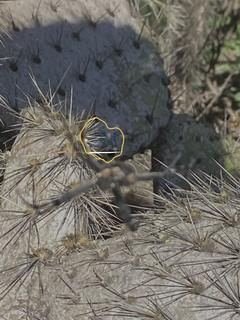 | 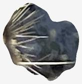 |  `#444953` darkslategray · 45,6 % `#63615B` dimgray · 19,5 % `#2A2929` black · 16,7 % `#918D83` gray · 12,6 % `#DBD9CE` gainsboro · 5,7 % | ***A. argentata*** `dcdbd5aa2d0715aa.jpg` score 0,949 54.934 px · 1,75 % © mooseandsquirrel · [CC-BY-NC](https://creativecommons.org/licenses/by-nc/4.0/) · [GBIF](https://www.gbif.org/occurrence/6178745683) |
|  |  |  `#423447` darkslategray · 30,1 % `#7E616E` dimgray · 25,8 % `#B79AA2` rosybrown · 21,8 % `#F0E0E2` mistyrose · 18,8 % `#FAEDAF` palegoldenrod · 3,4 % | ***A. argentata*** `e6092e006df2260f.jpg` score 0,900 55.669 px · 1,77 % © Helena · [CC-BY-NC](https://creativecommons.org/licenses/by-nc/4.0/) · [GBIF](https://www.gbif.org/occurrence/6185691601) |
|  |  |  `#11100A` black · 43,8 % `#3B3B32` darkslategray · 29,4 % `#615F51` dimgray · 13,9 % `#462F14` black · 8,0 % `#A9A596` darkgray · 4,9 % | ***A. argentata*** `e8348f1d6fa08a20.jpg` score 0,871 20.420 px · 0,65 % © Salvatore Angius · [CC-BY-NC](https://creativecommons.org/licenses/by-nc/4.0/) · [GBIF](https://www.gbif.org/occurrence/6179217653) |
|  |  |  `#E7E3D0` antiquewhite · 36,8 % `#F8F9F6` whitesmoke · 27,3 % `#C4BD9C` tan · 16,7 % `#95977A` darkgray · 14,0 % `#676554` dimgray · 5,1 % | ***A. argentata*** `e93682e6de74647c.jpg` score 0,959 37.528 px · 1,19 % © pierrebonmariage · [CC-BY-NC](https://creativecommons.org/licenses/by-nc/4.0/) · [GBIF](https://www.gbif.org/occurrence/6178719753) |
|  |  |  `#1E180C` black · 48,2 % `#514125` dimgray · 17,5 % `#425323` darkolivegreen · 15,7 % `#AA8D5D` tan · 12,5 % `#CA993C` darkgoldenrod · 6,2 % | ***A. argentata*** `ebe3e109d13dc5d2.jpg` score 0,968 33.773 px · 1,79 % © emilly2020 · [CC-BY-NC](https://creativecommons.org/licenses/by-nc/4.0/) · [GBIF](https://www.gbif.org/occurrence/6185191764) |
| 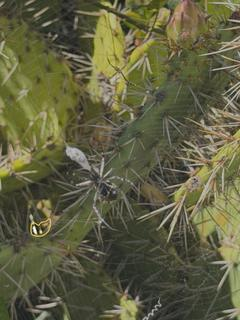 | 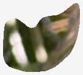 |  `#565434` darkolivegreen · 26,1 % `#313515` darkslategray · 22,8 % `#6F6552` dimgray · 22,4 % `#A28F72` tan · 17,5 % `#E5DAD0` gainsboro · 11,2 % | ***A. argentata*** `f9811618a7507156.jpg` score 0,854 9.613 px · 0,31 % © Zoe Nix · [CC-BY-NC](https://creativecommons.org/licenses/by-nc/4.0/) · [GBIF](https://www.gbif.org/occurrence/6178378318) |
|  |  |  `#ECF0E3` oldlace · 32,4 % `#5D624E` dimgray · 20,2 % `#3C3F31` darkslategray · 18,7 % `#BDC1B3` silver · 14,8 % `#8B8F7E` gray · 14,0 % | ***A. aurantia*** `0bd9aa0e8391caba.jpg` score 0,845 14.953 px · 0,54 % © tom kelley · [CC-BY-NC](https://creativecommons.org/licenses/by-nc/4.0/) · [GBIF](https://www.gbif.org/occurrence/6320350624) |
|  |  |  `#AE9178` rosybrown · 24,0 % `#987B6B` rosybrown · 20,7 % `#9A8781` gray · 19,9 % `#AF9E96` darkgray · 19,1 % `#806C68` dimgray · 16,4 % | ***A. aurantia*** `131191bffe7c4a47.jpg` score 0,982 111.745 px · 2,68 % © Linda Jo Conn · [CC-BY](https://creativecommons.org/licenses/by/4.0/) · [GBIF](https://www.gbif.org/occurrence/6185796589) |
|  |  |  `#472418` black · 29,5 % `#623D2C` dimgray · 27,7 % `#7F5948` dimgray · 21,1 % `#291109` black · 13,2 % `#A37F6E` rosybrown · 8,5 % | ***A. aurantia*** `2bd679d42401a237.jpg` score 0,814 5.535 px · 0,18 % © Nikolett Tóth · [CC-BY-NC](https://creativecommons.org/licenses/by-nc/4.0/) · [GBIF](https://www.gbif.org/occurrence/6184967729) |
|  |  |  `#4B7755` darkolivegreen · 33,3 % `#82A686` darkseagreen · 22,9 % `#C4DCBB` beige · 21,9 % `#A7A781` tan · 14,2 % `#3D4A2D` darkslategray · 7,7 % | ***A. aurantia*** `2d5d238fab2a11f9.jpg` score 0,850 41.264 px · 1,33 % © chrisbr93 · [CC-BY-NC](https://creativecommons.org/licenses/by-nc/4.0/) · [GBIF](https://www.gbif.org/occurrence/6414043443) |
|  |  |  `#CFE1C3` beige · 29,5 % `#41532D` darkolivegreen · 24,5 % `#6C7D57` darkolivegreen · 22,0 % `#A2B392` darkseagreen · 19,5 % `#2E2E1C` darkslategray · 4,5 % | ***A. aurantia*** `2fa628c877192eb2.jpg` score 0,945 126.425 px · 4,02 % © Madi · [CC-BY-NC](https://creativecommons.org/licenses/by-nc/4.0/) · [GBIF](https://www.gbif.org/occurrence/6352830342) |
|  |  |  `#1E1E18` black · 26,1 % `#717061` dimgray · 25,8 % `#464436` darkslategray · 22,4 % `#9FA295` darkgray · 18,3 % `#DADBBE` beige · 7,4 % | ***A. aurantia*** `4a4b38652ce9013f.jpg` score 0,947 36.914 px · 1,44 % © Misty Keith · [CC-BY-NC](https://creativecommons.org/licenses/by-nc/4.0/) · [GBIF](https://www.gbif.org/occurrence/6422330493) |
|  |  |  `#676756` dimgray · 23,0 % `#1C1B12` black · 22,3 % `#333224` darkslategray · 21,4 % `#4D4C3C` dimgray · 20,8 % `#838573` gray · 12,5 % | ***A. aurantia*** `55d96b327e1405d7.jpg` score 0,923 17.563 px · 0,75 % © rowanny · [CC-BY-NC](https://creativecommons.org/licenses/by-nc/4.0/) · [GBIF](https://www.gbif.org/occurrence/6195386962) |
|  |  |  `#AAA997` darkgray · 24,9 % `#E3EBDB` beige · 22,8 % `#7A7563` gray · 18,9 % `#494338` darkslategray · 17,4 % `#1E1913` black · 15,9 % | ***A. aurantia*** `5ce022b07db9663e.jpg` score 0,970 69.831 px · 2,22 % © hoppy15 · [CC-BY-NC](https://creativecommons.org/licenses/by-nc/4.0/) · [GBIF](https://www.gbif.org/occurrence/6400510743) |
|  |  |  `#A69D86` darkgray · 27,2 % `#C3C5B6` silver · 22,8 % `#4C2D18` saddlebrown · 21,7 % `#7D6B55` dimgray · 17,7 % `#885D36` sienna · 10,6 % | ***A. aurantia*** `5d24cf8b6bfe5c6c.jpg` score 0,775 7.886 px · 0,28 % © Dave Suszcynsky · [CC-BY-NC](https://creativecommons.org/licenses/by-nc/4.0/) · [GBIF](https://www.gbif.org/occurrence/6413763800) |
|  |  |  `#452517` black · 31,3 % `#593626` dimgray · 30,4 % `#724B3A` dimgray · 20,1 % `#7E6457` dimgray · 13,1 % `#9F8F8C` gray · 5,1 % | ***A. aurantia*** `5e44cc99ffe4cd91.jpg` score 0,972 191.580 px · 6,65 % © Carolyn Caywood · [CC-BY-NC](https://creativecommons.org/licenses/by-nc/4.0/) · [GBIF](https://www.gbif.org/occurrence/6184885277) |
|  |  |  `#F4DBA8` navajowhite · 47,5 % `#C0B194` tan · 23,0 % `#DBC7A0` tan · 20,6 % `#26241A` black · 6,0 % `#76664F` dimgray · 2,8 % | ***A. aurantia*** `7a2b1daf26281800.jpg` score 0,937 47.219 px · 1,50 % © tbluett · [CC-BY-NC](https://creativecommons.org/licenses/by-nc/4.0/) · [GBIF](https://www.gbif.org/occurrence/6399186467) |
| 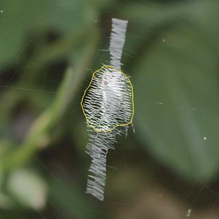 | 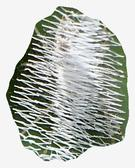 |  `#E4E8E6` gainsboro · 30,0 % `#B1B6B3` silver · 24,3 % `#262D1F` darkslategray · 17,6 % `#71766F` dimgray · 15,6 % `#54613E` darkolivegreen · 12,5 % | ***A. aurantia*** `7b5bbeac4b2032b5.jpg` score 0,978 88.258 px · 5,40 % © Misty Keith · [CC-BY-NC](https://creativecommons.org/licenses/by-nc/4.0/) · [GBIF](https://www.gbif.org/occurrence/6251477170) |
|  |  |  `#ADADA2` darkgray · 50,6 % `#9FA095` darkgray · 21,6 % `#BDBEB2` silver · 19,2 % `#353635` darkslategray · 6,0 % `#666761` dimgray · 2,6 % | ***A. aurantia*** `817d6255d3a09113.jpg` score 0,922 77.829 px · 2,47 % © praishja · [CC-BY-NC](https://creativecommons.org/licenses/by-nc/4.0/) · [GBIF](https://www.gbif.org/occurrence/6400029417) |
|  |  |  `#6F6454` dimgray · 21,7 % `#958F83` gray · 21,2 % `#151412` black · 21,1 % `#BABBB9` silver · 19,9 % `#463C32` darkslategray · 16,1 % | ***A. aurantia*** `8375845b78d249f0.jpg` score 0,965 145.708 px · 5,21 % © Maximillion (max) Cipov · [CC-BY-NC](https://creativecommons.org/licenses/by-nc/4.0/) · [GBIF](https://www.gbif.org/occurrence/6163170021) |
|  |  |  `#D1E1CC` beige · 27,5 % `#ADBA9D` darkseagreen · 25,1 % `#848B58` darkolivegreen · 19,9 % `#7F917B` gray · 15,4 % `#4F5727` darkolivegreen · 12,1 % | ***A. aurantia*** `92130bec53fde47a.jpg` score 0,729 1.906 px · 0,24 % © Megan Kossa · [CC-BY](https://creativecommons.org/licenses/by/4.0/) · [GBIF](https://www.gbif.org/occurrence/6399675153) |
|  |  |  `#EEE9E1` linen · 43,2 % `#291C16` black · 25,8 % `#AFA297` darkgray · 13,6 % `#66554C` dimgray · 12,1 % `#677E34` darkolivegreen · 5,3 % | ***A. aurantia*** `a45c890d4dc723ef.jpg` score 0,964 12.677 px · 1,15 % © Shinobu · [CC-BY](https://creativecommons.org/licenses/by/4.0/) · [GBIF](https://www.gbif.org/occurrence/6413596964) |
| 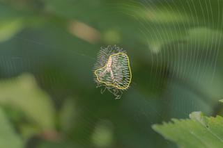 | 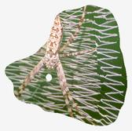 |  `#405924` darkolivegreen · 30,4 % `#69714F` darkolivegreen · 21,6 % `#D8CCC9` lightgray · 19,5 % `#9B9B99` darkgray · 17,3 % `#AE9577` tan · 11,2 % | ***A. aurantia*** `b938e737e84f50bc.jpg` score 0,940 72.280 px · 2,59 % © Brooks Oakley · [CC-BY-NC](https://creativecommons.org/licenses/by-nc/4.0/) · [GBIF](https://www.gbif.org/occurrence/6412958553) |
|  |  |  `#9F8B68` tan · 27,7 % `#CCB793` tan · 24,2 % `#715D39` darkolivegreen · 21,0 % `#566B3C` darkolivegreen · 14,6 % `#3B2F16` black · 12,5 % | ***A. aurantia*** `ced10dfeb081ce47.jpg` score 0,964 311.082 px · 9,89 % © Jo Ann Cosbey · [CC-BY-NC](https://creativecommons.org/licenses/by-nc/4.0/) · [GBIF](https://www.gbif.org/occurrence/6252739885) |
|  |  |  `#90A57F` darkseagreen · 34,6 % `#71845A` darkolivegreen · 24,7 % `#819660` darkseagreen · 20,9 % `#5B7339` darkolivegreen · 16,8 % `#53614A` dimgray · 3,0 % | ***A. aurantia*** `d6d17e057d9c3dbc.jpg` score 0,815 23.527 px · 0,75 % © Mariah McVey · [CC-BY-NC](https://creativecommons.org/licenses/by-nc/4.0/) · [GBIF](https://www.gbif.org/occurrence/6398833609) |
|  |  |  `#D3D3C1` lightgray · 26,0 % `#B2AC93` tan · 26,0 % `#9B8C5C` tan · 22,0 % `#6A6621` darkolivegreen · 13,4 % `#554214` darkolivegreen · 12,6 % | ***A. aurantia*** `e6717a8418dd7a6f.jpg` score 0,975 158.323 px · 5,03 % © wingbar · [CC-BY-NC](https://creativecommons.org/licenses/by-nc/4.0/) · [GBIF](https://www.gbif.org/occurrence/6188061603) |
| 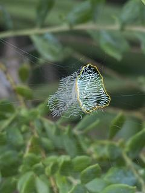 | 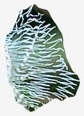 |  `#D6EEEE` lightcyan · 29,0 % `#9EB7B7` darkgray · 21,9 % `#637D71` gray · 21,1 % `#314437` darkslategray · 15,1 % `#0E1C1C` black · 12,9 % | ***A. aurantia*** `e789afcdeec1cc42.jpg` score 0,973 122.208 px · 3,88 % © Dan_Barychko · [CC-BY-NC](https://creativecommons.org/licenses/by-nc/4.0/) · [GBIF](https://www.gbif.org/occurrence/6422035591) |
| 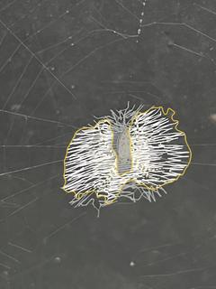 | 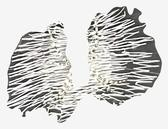 |  `#F9F8F3` whitesmoke · 41,9 % `#53524F` dimgray · 22,0 % `#C7C5C0` silver · 14,1 % `#302E2C` darkslategray · 11,7 % `#8D8B87` gray · 10,3 % | ***A. aurantia*** `f14834ec301bb911.jpg` score 0,959 366.847 px · 11,66 % © maddsnature · [CC-BY-NC](https://creativecommons.org/licenses/by-nc/4.0/) · [GBIF](https://www.gbif.org/occurrence/6352362797) |
|  |  |  `#E9DEBB` wheat · 37,8 % `#B5A895` darkgray · 26,4 % `#F8F5ED` floralwhite · 22,4 % `#B8B4C5` silver · 9,5 % `#794C67` dimgray · 3,9 % | ***A. bruennichi*** `00f57889195ba0ba.jpg` score 0,977 71.200 px · 2,06 % © Daniele Gatti · [CC-BY-NC](https://creativecommons.org/licenses/by-nc/4.0/) · [GBIF](https://www.gbif.org/occurrence/6479166919) |
|  |  |  `#E8E3A2` palegoldenrod · 32,4 % `#E2DA86` khaki · 29,2 % `#E7E3BF` blanchedalmond · 14,8 % `#C2B775` darkkhaki · 14,3 % `#898455` darkolivegreen · 9,3 % | ***A. bruennichi*** `08b4ed69f881d323.jpg` score 0,915 4.004 px · 0,60 % © User 202365 · [CC-BY-NC](https://creativecommons.org/licenses/by-nc/4.0/) · [GBIF](https://www.gbif.org/occurrence/6447794500) |
|  |  |  `#A18759` tan · 27,2 % `#725A39` dimgray · 22,6 % `#C4B77C` darkkhaki · 21,8 % `#433527` darkslategray · 16,9 % `#F9EE7F` khaki · 11,6 % | ***A. bruennichi*** `0a4b7bf88a5f513d.jpg` score 0,973 12.312 px · 1,64 % © User 230217 · [CC-BY-NC](https://creativecommons.org/licenses/by-nc/4.0/) · [GBIF](https://www.gbif.org/occurrence/6423712770) |
|  |  |  `#716B37` darkolivegreen · 30,8 % `#898651` darkolivegreen · 27,5 % `#5B501F` darkolivegreen · 17,7 % `#ADA572` tan · 13,1 % `#968155` tan · 10,9 % | ***A. bruennichi*** `35f04bdbce178408.jpg` score 0,965 18.150 px · 1,81 % © User 767098 · [CC-BY-NC](https://creativecommons.org/licenses/by-nc/4.0/) · [GBIF](https://www.gbif.org/occurrence/6424090543) |
|  |  |  `#61554E` dimgray · 25,2 % `#7F746C` gray · 21,7 % `#A49F97` darkgray · 20,2 % `#C6CAA8` wheat · 19,8 % `#40342F` darkslategray · 13,1 % | ***A. bruennichi*** `3610e6ff17c14ec0.jpg` score 0,794 3.641 px · 0,36 % © User 373902 · [CC-BY-NC](https://creativecommons.org/licenses/by-nc/4.0/) · [GBIF](https://www.gbif.org/occurrence/6424266519) |
|  |  |  `#DEDDC6` antiquewhite · 31,8 % `#C0BAA3` silver · 23,4 % `#EFF2EB` whitesmoke · 22,0 % `#928E84` gray · 14,6 % `#616257` dimgray · 8,3 % | ***A. bruennichi*** `3b75dee19792b37f.jpg` score 0,687 1.593 px · 0,06 % © Julien Tchilinguirian · [CC-BY](https://creativecommons.org/licenses/by/4.0/) · [GBIF](https://www.gbif.org/occurrence/6441260972) |
|  |  |  `#A0958C` darkgray · 24,5 % `#443D41` darkslategray · 24,4 % `#827A73` gray · 21,6 % `#61595A` dimgray · 16,6 % `#ACAAAF` darkgray · 12,8 % | ***A. bruennichi*** `40417d09891073b3.jpg` score 0,964 18.462 px · 1,85 % © User 970325 · [CC-BY-NC](https://creativecommons.org/licenses/by-nc/4.0/) · [GBIF](https://www.gbif.org/occurrence/6410872684) |
|  |  |  `#584546` dimgray · 22,7 % `#E9DAE0` gainsboro · 22,6 % `#BBAAAB` darkgray · 22,4 % `#8A7777` gray · 19,9 % `#2D1B1C` black · 12,3 % | ***A. bruennichi*** `4645418fc51d751b.jpg` score 0,980 25.356 px · 2,54 % © User 994349 · [CC-BY-NC](https://creativecommons.org/licenses/by-nc/4.0/) · [GBIF](https://www.gbif.org/occurrence/6424513450) |
|  |  |  `#B9B994` tan · 27,4 % `#F0EFBD` lemonchiffon · 24,0 % `#8F8B6A` gray · 22,4 % `#EAEDD4` beige · 13,2 % `#625740` dimgray · 12,9 % | ***A. bruennichi*** `56240195db4670d7.jpg` score 0,933 7.324 px · 0,98 % © User 936795 · [CC-BY-NC](https://creativecommons.org/licenses/by-nc/4.0/) · [GBIF](https://www.gbif.org/occurrence/6423570617) |
|  |  |  `#C1AF7C` tan · 35,2 % `#DBCAA1` wheat · 29,1 % `#9D8C5F` tan · 18,1 % `#65664A` dimgray · 13,3 % `#6B572B` darkolivegreen · 4,4 % | ***A. bruennichi*** `5650437e41cc008a.jpg` score 0,947 6.146 px · 0,82 % © User 960907 · [CC-BY-NC](https://creativecommons.org/licenses/by-nc/4.0/) · [GBIF](https://www.gbif.org/occurrence/6411204794) |
|  |  |  `#EBEBE8` whitesmoke · 35,9 % `#D3CEB5` antiquewhite · 26,1 % `#B4A675` tan · 14,0 % `#A69F8E` darkgray · 13,5 % `#796B51` dimgray · 10,5 % | ***A. bruennichi*** `5e56b2f436a1e3cc.jpg` score 0,971 44.661 px · 3,48 % © 05gi02el03 · [CC-BY-NC](https://creativecommons.org/licenses/by-nc/4.0/) · [GBIF](https://www.gbif.org/occurrence/6413133456) |
|  |  |  `#F8F7AC` palegoldenrod · 34,5 % `#F4F4C5` lemonchiffon · 28,0 % `#C7BE90` tan · 16,6 % `#928561` tan · 12,3 % `#5A4B33` dimgray · 8,7 % | ***A. bruennichi*** `601b8dc2e6b61421.jpg` score 0,980 21.377 px · 2,85 % © User 1079341 · [CC-BY-NC](https://creativecommons.org/licenses/by-nc/4.0/) · [GBIF](https://www.gbif.org/occurrence/6423826657) |
|  |  |  `#788353` darkolivegreen · 29,2 % `#94A16C` darkseagreen · 21,0 % `#879172` gray · 19,8 % `#56633F` darkolivegreen · 16,4 % `#ABB898` darkseagreen · 13,6 % | ***A. bruennichi*** `67f6841696ab7934.jpg` score 0,967 20.914 px · 2,09 % © User 782392 · [CC-BY-NC](https://creativecommons.org/licenses/by-nc/4.0/) · [GBIF](https://www.gbif.org/occurrence/6410867480) |
|  |  |  `#934F36` sienna · 22,9 % `#9A7253` rosybrown · 21,1 % `#E4C9A2` wheat · 20,2 % `#C09D7A` tan · 18,1 % `#5B3925` saddlebrown · 17,6 % | ***A. bruennichi*** `6d4314bcc41b5254.jpg` score 0,947 5.616 px · 0,56 % © User 156924 · [CC-BY-NC](https://creativecommons.org/licenses/by-nc/4.0/) · [GBIF](https://www.gbif.org/occurrence/6423765521) |
|  |  |  `#7F7125` olive · 34,5 % `#B79D48` darkkhaki · 21,6 % `#F3E16C` khaki · 15,4 % `#523A0C` saddlebrown · 14,5 % `#EADF9D` palegoldenrod · 14,1 % | ***A. bruennichi*** `8cc7e53bf82ee66c.jpg` score 0,973 62.290 px · 1,98 % © Sieglinde Meyer Puntscher · [CC-BY-NC](https://creativecommons.org/licenses/by-nc/4.0/) · [GBIF](https://www.gbif.org/occurrence/6431074533) |
|  |  |  `#C6C9AB` wheat · 26,3 % `#90936B` tan · 24,3 % `#5D6036` darkolivegreen · 23,0 % `#7F8D43` darkolivegreen · 14,5 % `#2B2D11` black · 11,9 % | ***A. bruennichi*** `96f8c0e7a5c221f1.jpg` score 0,972 11.886 px · 1,58 % © User 189810 · [CC-BY-NC](https://creativecommons.org/licenses/by-nc/4.0/) · [GBIF](https://www.gbif.org/occurrence/6424491312) |
|  |  |  `#EDD105` gold · 39,1 % `#DBC006` gold · 21,0 % `#C2AD06` goldenrod · 19,4 % `#A49B0E` olive · 13,1 % `#84861B` olive · 7,5 % | ***A. bruennichi*** `9a661f55ff3a2338.jpg` score 0,862 3.354 px · 0,34 % © User 199809 · [CC-BY-NC](https://creativecommons.org/licenses/by-nc/4.0/) · [GBIF](https://www.gbif.org/occurrence/6341960374) |
|  |  |  `#7F6260` dimgray · 46,7 % `#6F5451` dimgray · 19,0 % `#8E716F` gray · 15,3 % `#A38481` rosybrown · 10,8 % `#B49799` rosybrown · 8,2 % | ***A. bruennichi*** `9b1e4f289b36fd25.jpg` score 0,573 674 px · 0,02 % © Kristof Wührer · [CC-BY-NC](https://creativecommons.org/licenses/by-nc/4.0/) · [GBIF](https://www.gbif.org/occurrence/6185212768) |
|  |  |  `#C6B17E` tan · 25,0 % `#B5A492` darkgray · 23,3 % `#ECDCA8` wheat · 21,8 % `#DDD4C2` antiquewhite · 20,2 % `#8A6C4F` dimgray · 9,7 % | ***A. bruennichi*** `9cfa1cb61db972b3.jpg` score 0,980 35.587 px · 3,56 % © User 1075494 · [CC-BY-NC](https://creativecommons.org/licenses/by-nc/4.0/) · [GBIF](https://www.gbif.org/occurrence/6424296645) |
|  |  |  `#A1A379` tan · 29,4 % `#27261A` black · 23,8 % `#616246` dimgray · 17,7 % `#D1D6C7` lightgray · 14,9 % `#D5D39E` palegoldenrod · 14,2 % | ***A. bruennichi*** `a2fc5c202a10dab0.jpg` score 0,962 37.100 px · 1,33 % © harry beaman · [CC-BY](https://creativecommons.org/licenses/by/4.0/) · [GBIF](https://www.gbif.org/occurrence/6413912548) |
|  |  |  `#2D241E` black · 28,2 % `#46382D` darkslategray · 28,2 % `#6F5444` dimgray · 21,8 % `#97875E` tan · 12,6 % `#D2C98A` darkkhaki · 9,2 % | ***A. bruennichi*** `a9fb4a103310693e.jpg` score 0,650 294 px · 0,04 % © User 123534 · [CC-BY-NC](https://creativecommons.org/licenses/by-nc/4.0/) · [GBIF](https://www.gbif.org/occurrence/6424230481) |
|  |  |  `#DBD89E` palegoldenrod · 24,1 % `#BAB88E` tan · 22,4 % `#EFEFD7` beige · 20,6 % `#909577` gray · 20,0 % `#706B58` dimgray · 12,9 % | ***A. bruennichi*** `aadea17b216b658b.jpg` score 0,918 6.505 px · 0,87 % © User 1202677 · [CC-BY-NC](https://creativecommons.org/licenses/by-nc/4.0/) · [GBIF](https://www.gbif.org/occurrence/6412375694) |
|  |  |  `#A7A168` darkkhaki · 28,2 % `#ECE9B9` lemonchiffon · 23,9 % `#EAE286` khaki · 21,1 % `#6B6332` darkolivegreen · 16,9 % `#211A07` black · 9,9 % | ***A. bruennichi*** `afedd500df72ae16.jpg` score 0,986 71.189 px · 7,12 % © User 991876 · [CC-BY-NC](https://creativecommons.org/licenses/by-nc/4.0/) · [GBIF](https://www.gbif.org/occurrence/6424000656) |
|  |  |  `#8B937E` gray · 23,2 % `#BFBFA3` tan · 22,9 % `#32332C` darkslategray · 20,9 % `#E8E6B3` palegoldenrod · 19,7 % `#60604F` dimgray · 13,3 % | ***A. bruennichi*** `c6726664e01fb407.jpg` score 0,981 40.179 px · 4,02 % © User 1240336 · [CC-BY-NC](https://creativecommons.org/licenses/by-nc/4.0/) · [GBIF](https://www.gbif.org/occurrence/6424625729) |
|  |  |  `#554D1C` darkolivegreen · 22,2 % `#26200A` black · 21,6 % `#F0EDB1` palegoldenrod · 21,4 % `#939353` darkkhaki · 19,7 % `#F6F197` khaki · 15,1 % | ***A. bruennichi*** `ce285fafdfd82efb.jpg` score 0,953 5.088 px · 1,10 % © User 1095073 · [CC-BY-NC](https://creativecommons.org/licenses/by-nc/4.0/) · [GBIF](https://www.gbif.org/occurrence/6424303485) |
|  |  |  `#424F33` darkslategray · 24,5 % `#DDE9A5` palegoldenrod · 22,9 % `#67744B` darkolivegreen · 19,0 % `#E9F2CC` lightgoldenrodyellow · 18,0 % `#9DA875` darkseagreen · 15,7 % | ***A. bruennichi*** `f6f4652284a4fdfa.jpg` score 0,694 785 px · 0,10 % © User 1261476 · [CC-BY-NC](https://creativecommons.org/licenses/by-nc/4.0/) · [GBIF](https://www.gbif.org/occurrence/6423701454) |

## Las 27 sin máscara

El U-Net no devolvió ningún píxel. El adaptador lo registra como `skip` con su motivo en `skipped.csv` en vez de pasar una región vacía aguas abajo — pero es un fallo real del modelo, no un detalle de contabilidad.

| Especie | Imagen |
|---|---|
| *A. argentata* | `0e20c781f135b0a3.jpg` |
| *A. argentata* | `10411f5fc991e84d.jpg` |
| *A. argentata* | `1bebac7d6e90fe4e.jpg` |
| *A. argentata* | `448b61f3e3a692ac.jpg` |
| *A. argentata* | `aafcf842c5581eb0.jpg` |
| *A. argentata* | `abdf7ea9809a9230.jpg` |
| *A. argentata* | `c06565d8eb972de2.jpg` |
| *A. argentata* | `c3511db4c325fbad.jpg` |
| *A. argentata* | `d222c7992484f41f.jpg` |
| *A. aurantia* | `04b6aa944b6e7c2b.jpg` |
| *A. aurantia* | `75e6c4f3263e976b.jpg` |
| *A. aurantia* | `7ec0f5b096cf7676.jpg` |
| *A. aurantia* | `8da67ac846422946.jpg` |
| *A. aurantia* | `981196830e906fe2.jpg` |
| *A. aurantia* | `9a825c65d833b2a9.jpg` |
| *A. aurantia* | `9c2b1b5453ac0d37.jpg` |
| *A. aurantia* | `cdfaeff27f20c538.jpg` |
| *A. aurantia* | `e2d5cb14c86cde5f.jpg` |
| *A. aurantia* | `e6e26328d1a07593.jpg` |
| *A. aurantia* | `f34b4f92e1afcc94.jpg` |
| *A. aurantia* | `f7807ad5593c8bbe.jpg` |
| *A. bruennichi* | `1e7f5dfe52d7a75d.jpg` |
| *A. bruennichi* | `26c84f9404f56547.jpg` |
| *A. bruennichi* | `888983a1cce76e33.jpg` |
| *A. bruennichi* | `a27b843012508fd9.jpg` |
| *A. bruennichi* | `f459a6e224e410e1.jpg` |
| *A. bruennichi* | `ffc53159e8c9b532.jpg` |

---

Generado por `repro/segmentr/adapt_unet.py` (run `unseen100`). Reproducible desde `run_config.json`. Los colores se reportan como HEX, coordenadas Lab y cobertura: no se afirma compatibilidad con PANTONE®.
